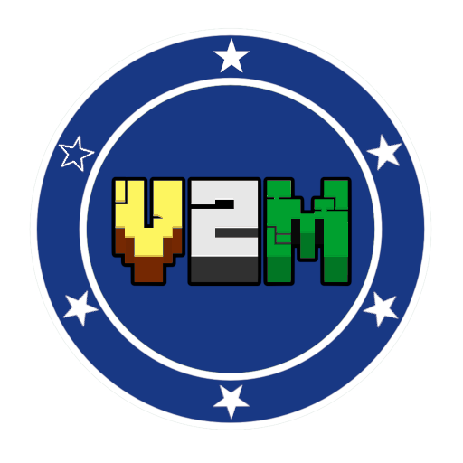
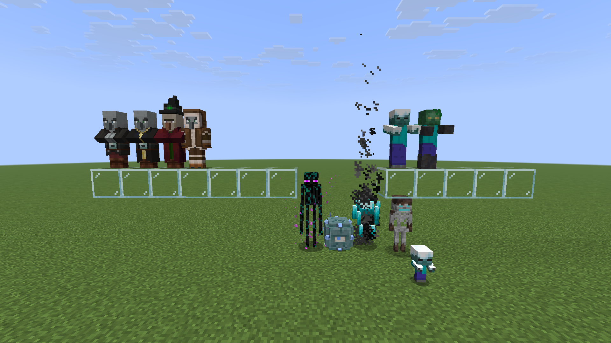
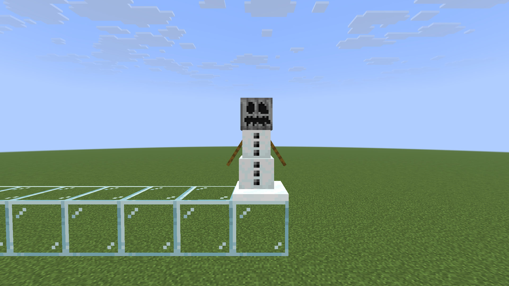
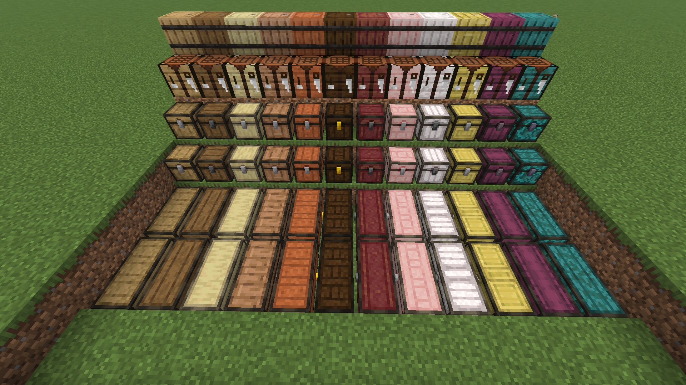
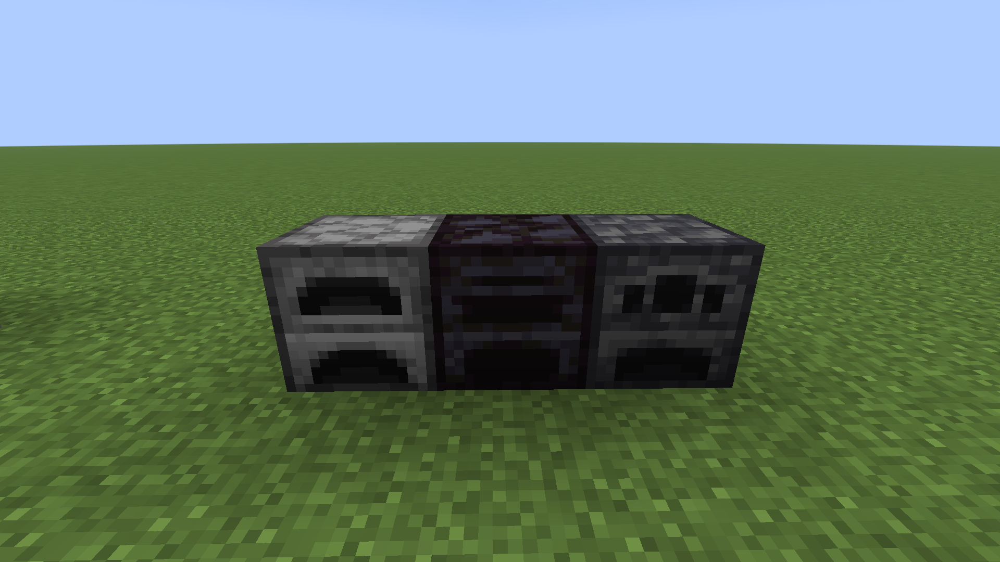
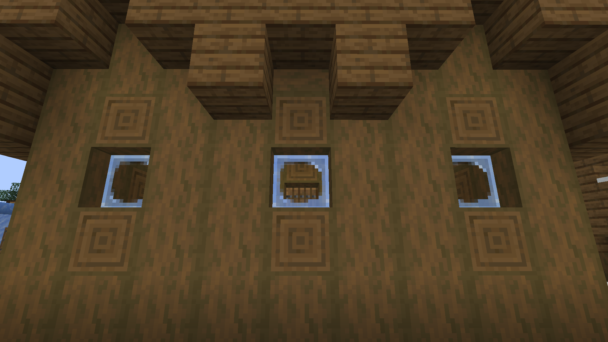
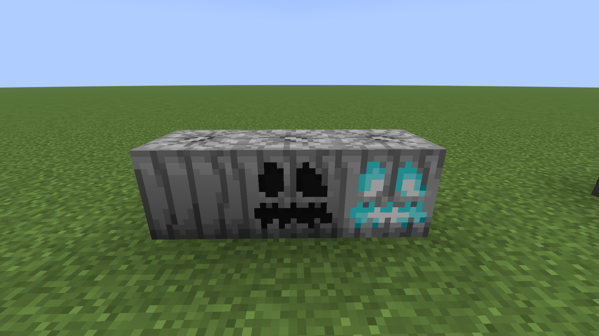

# Vinii's Variants Mod (V2M)

## Features

### Mobs
Added several mob variants

<ul>
    <li>Icid Zombie (Snowy Biomes)</li>
    <li>Swamp Zombie (Swamps)</li>
    <li>Frozen Guardian (Cold/Frozen Oceans)</li>
    <li>Soul Skeleton (Soul Sand Valleys)</li>
    <li>Soul Blaze (Soul Sand Valleys)</li>
    <li>Warped Enderman (Warped Forests)</li>
    <li>Raid Vindicator, Evoker, Witch, (On Village Raids)</li>
    <li>Mountaineer Pillager (Snowy Biomes)</li>
</ul>

Pale Snow Golems can be spawned with pale pumpkins

### Blocks

### Glass panes

Glass panes placed in all snowy biomes become frosted (can be ignored if crouching while placing)

### Pale Pumpkins

Pale pumpkins naturally spawn in Pale Gardens, they behave as a normal pumpkin but spawn Pale Snow Golems and can be
Farmed TODO: cannot be farmed since there aren't seeds yet

TODO: create seeds

### Structures

All structures generate with biome and dimension based variant utility blocks, see <b>getReplacedBlock</b> in
<a href="src/main/java/com/vinii/v2m/world/structure/VariantsStructureProcessor.java?plain=1">
    here
</a>
and the <b>variant biome tags</b> in
<a href="src/main/java/com/vinii/v2m/datagen/tag/ModBiomeTagProvider.java?plain=1">
    here
</a>

The end dimension is not affected by this at all.

<ul>
    <li>
        Snowy villages generate with frosted glass panes instead of glass panes  
    </li>
    <!-- Experimental <li>
        Woodland mansions generated in Pale gardens are made of pale oak  
    </li> -->
    <!-- Unfinished <li>
        Nether fortresses generate with red nether bricks in crimson forests (TODO: this todo is never getting realized, everything is hardcoded, I AM NOT CHANGING 1200 VALUES BRUH)
    </li> -->
</ul>

## Additional features

<ul>
    <!-- Chests -->
    <li>Donkeys and Mules accept Modded chests</li>
    <li>Copper golems look for Modded Chests</li>
    <!-- Pumpkins -->
    <li>Carved Pale Pumpkins spawn Iron, Copper, and pale snow golems (also with dispensers)</li>
    <li>Pale pumpkins are valid composter items</li>
    <li>Carved Pale Pumpkin can be equipped in your head, enchanted, and endermen ignore you</li>
    <li>Endermen can grab pale pumpkins</li>
    <li>Piglins are scared of Pale Jack o' Lanterns</li>
    <li>Wandering trader sells pale pumpkins</li> TODO:
    <li>Farmers buy pale pumpkins for emeralds</li> TODO:
    <!-- Barrels -->
    <li>Mod barrels are valid fisherman profession sites</li>
</ul>

## Additional vanilla changes

<ul>
    <li>Chest (& Trapped), Crafting table, Barrel and Furnace have been retextured and renamed to their now new variant
    </li>
    <li>All Copper chest containers have been renamed from "Chest" -> "Copper Chest"</li>
    <li>Modified several vanilla recipes (related to item variants)(mostly to include the recipes in a group)</li>
</ul>

## Mods that complement

Some mods with features that fit really well with this mod

<ul>
    <li>
        <a href="https://modrinth.com/mod/universal_ores">Universal Ores</a>
    </li>
</ul>

## Known issues

<ul>
    <li>Oak Chest(Vanilla Chest) break particles display chest.png instead of oak_planks.png</li>
    <li>Large structure's (like mansions) chests generate on a different biome and possibly with awkward rotation (TODO:)</li>
</ul>

# Credits

Many of the assets this mod uses come from other mods, and thus it requires proper creditation:

All Wood Chest and Trapped Chest textures are credited to the <a href="https://github.com/lieonlion/more-chest-variants">More Chest Variants Mod</a>

All Barrel textures are credited to the <a href="https://github.com/pnk2u/More-Barrel-Variants">More Barrel Variants Mod</a>

All Crafting Table textures are credited to the <a href="https://github.com/lieonlion/More-Crafting-Tables">More Crafting Tables Mod</a>

All Blackstone and Deepslate Furnace textures are credited to the <a href="https://github.com/lieonlion/More-Furnace-Variants">More Furnace Variants Mod</a>

All Pale Pumpkin textures are credited to the <a href="https://github.com/DrexHD/InstantFeedback">Instant Feedback Mod</a>

See <a href="NOTICES">NOTICES</a> for each individual license.

# License

This project is licensed under the **Creative Commons Attribution-NonCommercial-ShareAlike 4.0 International License**. 

You are free to share and remix this work as long as you provide appropriate attribution, do not use it for commercial purposes, and distribute your contributions under this exact same license. 

See the <a href="LICENSE">LICENSE</a> file for details.
